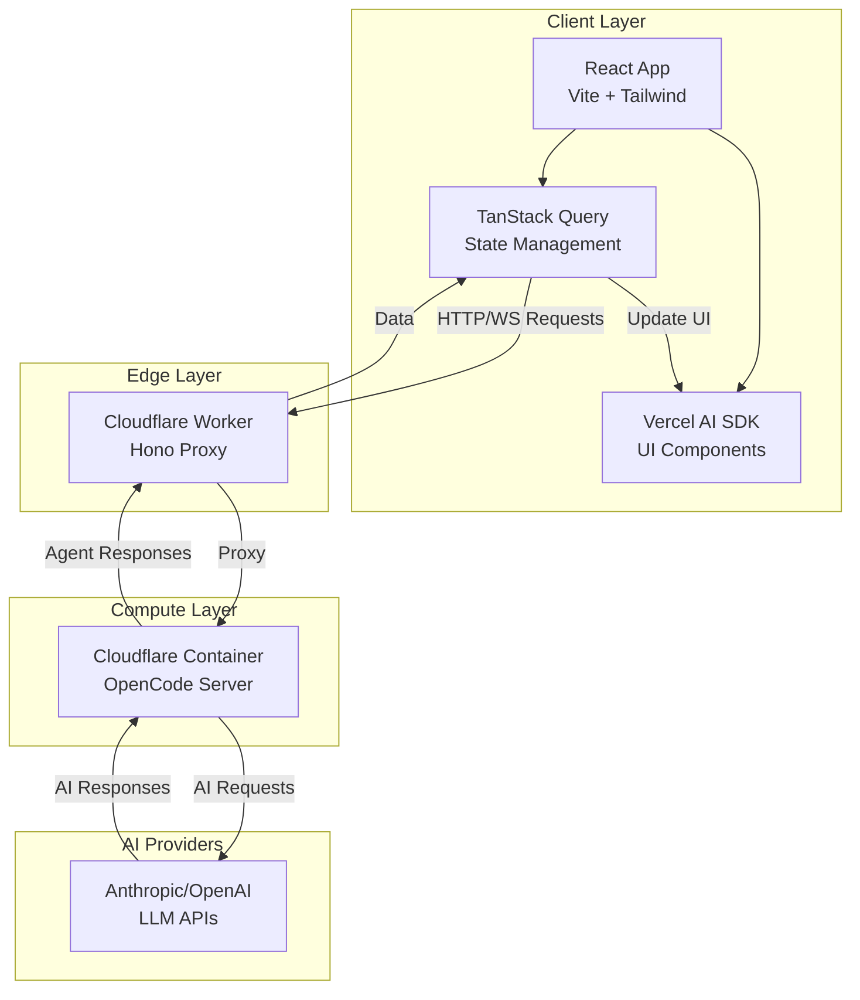
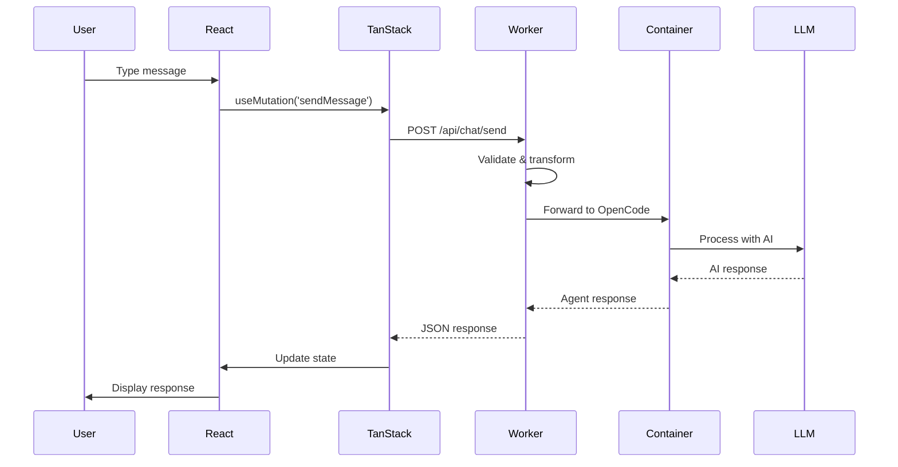
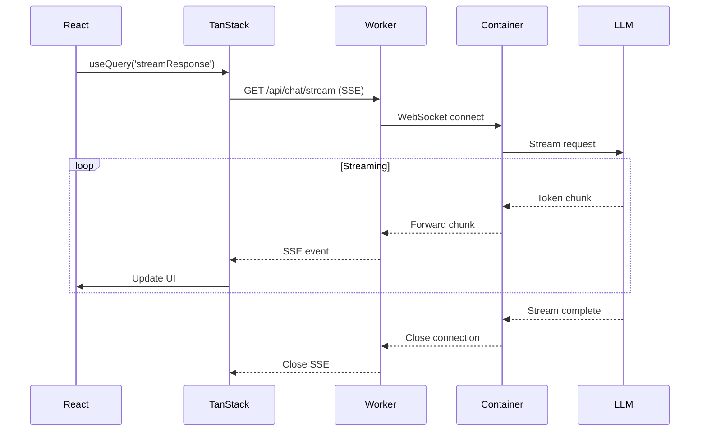
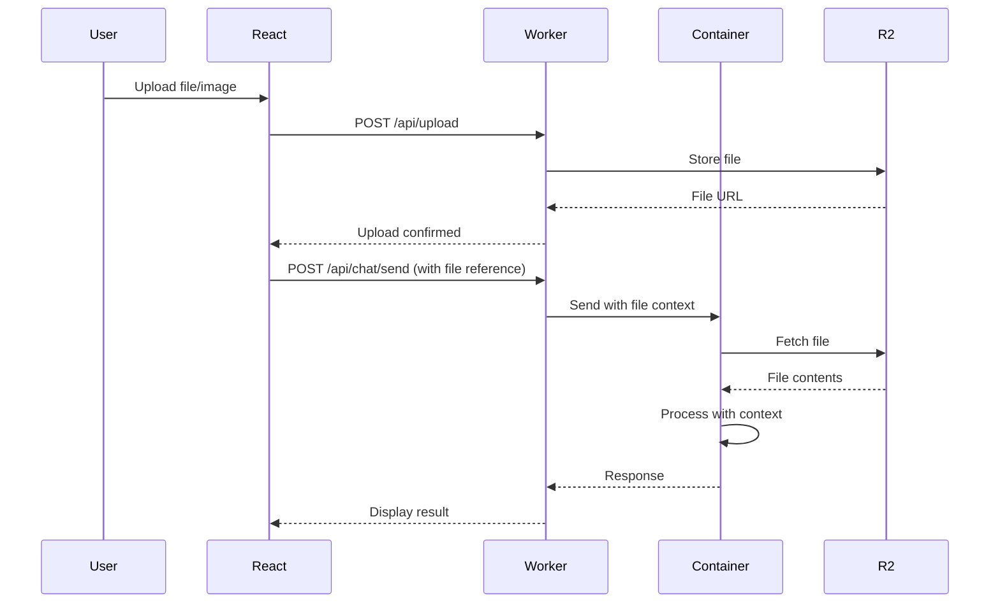

# OpenCode Web - Requirements Document

## Executive Summary

OpenCode Web is a web-based AI coding agent interface that brings the power of OpenCode's terminal-based AI coding assistant to the browser. The application leverages Cloudflare's infrastructure to provide a scalable, serverless architecture that proxies requests between a React frontend and an OpenCode server running in a Cloudflare Container.

## Architecture Overview



## Technology Stack

### Frontend
- **Framework**: React 19 + Vite
- **Styling**: Tailwind v4 + shadcn/ui
- **UI Components**: Vercel AI SDK Elements
- **State Management**: TanStack Query v5
- **Language**: TypeScript

### Backend
- **Proxy Layer**: Hono (on Cloudflare Workers)
- **Container Runtime**: Cloudflare Containers
- **Agent Server**: OpenCode Server
- **Data Storage**: Cloudflare D1/Durable Objects (for sessions/history)

### Infrastructure
- **Platform**: Cloudflare
- **Deployment**: Wrangler CLI
- **Container Registry**: Docker/OCI compatible

## Component Architecture

### 1. React Application (`src/react-app/`)

**Purpose**: Provide web-based UI for interacting with OpenCode agent

**Key Features**:
- Chat-based interface using Vercel AI SDK Elements
- File upload/image context support
- Conversation history
- Real-time streaming responses
- Code diff visualization
- Plan/Build mode toggle

**Key Components**:
```
src/react-app/
├── pages/
│   ├── ChatPage.tsx          # Main chat interface
│   ├── HistoryPage.tsx       # Conversation history
│   └── SettingsPage.tsx      # Configuration
├── features/
│   ├── chat/
│   │   ├── ChatContainer.tsx
│   │   ├── MessageList.tsx
│   │   └── PromptInput.tsx
│   └── code/
│       ├── CodeDiffViewer.tsx
│       └── FileTreeViewer.tsx
```

### 2. Cloudflare Worker Proxy (`src/worker/`)

**Purpose**: Proxy and transform requests between frontend and OpenCode container

**Key Features**:
- HTTP request proxying to container
- WebSocket support for streaming
- Authentication/authorization
- Rate limiting
- Request/response transformation
- Session management

**API Endpoints**:
```typescript
// Core chat endpoints
POST   /api/chat/send           # Send message to agent
GET    /api/chat/stream         # SSE stream for responses
POST   /api/chat/undo           # Undo last change
POST   /api/chat/redo           # Redo change

// Session management
GET    /api/sessions            # List sessions
POST   /api/sessions            # Create session
GET    /api/sessions/:id        # Get session
DELETE /api/sessions/:id        # Delete session

// Configuration
GET    /api/config              # Get user config
PUT    /api/config              # Update config

// Container health
GET    /api/health              # Container status
```

### 3. OpenCode Container

**Purpose**: Run OpenCode server in isolated container environment

**Configuration**:
- Base Image: Node.js LTS or official OpenCode image
- Exposed Port: 8080
- Health Check: `/health` endpoint
- Environment Variables:
  - `OPENCODE_API_KEY`
  - `ANTHROPIC_API_KEY`
  - `OPENAI_API_KEY`
  - `LOG_LEVEL`

**Container Properties**:
```typescript
export class OpenCodeContainer extends Container {
  defaultPort = 8080;
  maxInstances = 10;
  sleepAfter = "15m";

  async start() {
    // Initialize OpenCode server
    // Configure LLM providers
    // Set up project context
  }
}
```

## Request Flow Diagrams

### Standard Chat Message Flow



### Streaming Response Flow



### File Upload/Context Flow



## Data Models

### Session
```typescript
interface Session {
  id: string;
  userId: string;
  projectId?: string;
  createdAt: string;
  updatedAt: string;
  metadata: {
    title: string;
    mode: 'plan' | 'build';
    tags: string[];
  };
}
```

### Message
```typescript
interface Message {
  id: string;
  sessionId: string;
  role: 'user' | 'assistant' | 'system';
  content: string;
  timestamp: string;
  metadata?: {
    fileReferences?: string[];
    imageReferences?: string[];
    codeChanges?: CodeChange[];
  };
}
```

### CodeChange
```typescript
interface CodeChange {
  id: string;
  messageId: string;
  filePath: string;
  changeType: 'create' | 'edit' | 'delete';
  diff: string;
  applied: boolean;
}
```

### UserConfig
```typescript
interface UserConfig {
  userId: string;
  llmProvider: 'anthropic' | 'openai' | 'opencode-zen';
  model: string;
  theme: 'light' | 'dark' | 'system';
  preferences: {
    autoApplyChanges: boolean;
    showLineNumbers: boolean;
    enableImageContext: boolean;
  };
}
```

## State Management with TanStack Query

### Query Keys Structure
```typescript
const queryKeys = {
  sessions: ['sessions'] as const,
  session: (id: string) => ['sessions', id] as const,
  messages: (sessionId: string) => ['messages', sessionId] as const,
  config: ['config'] as const,
  health: ['health'] as const,
};
```

### Key Hooks
```typescript
// Queries
useQuery({
  queryKey: queryKeys.sessions,
  queryFn: fetchSessions,
  staleTime: 5 * 60 * 1000, // 5 minutes
});

useQuery({
  queryKey: queryKeys.messages(sessionId),
  queryFn: () => fetchMessages(sessionId),
  refetchInterval: false, // Use SSE instead
});

// Mutations
useMutation({
  mutationFn: sendMessage,
  onSuccess: (data, variables) => {
    queryClient.invalidateQueries({
      queryKey: queryKeys.messages(variables.sessionId)
    });
  },
});

// Streaming with custom hook
useStreamingQuery({
  queryKey: ['stream', messageId],
  endpoint: `/api/chat/stream/${messageId}`,
  onChunk: (chunk) => {
    // Update optimistic response
  },
});
```

## UI Components (Vercel AI SDK Elements)

### Primary Components

1. **Chatbot Component**
   - Main container for chat interface
   - Handles message display and input
   - Integrates with TanStack Query for state

2. **Message Component**
   - Renders individual messages
   - Supports markdown/code formatting
   - Shows user/assistant avatars

3. **Prompt Input Component**
   - Text input with file upload
   - Image paste/drag-drop support
   - Command suggestions

4. **Code Block Component**
   - Syntax highlighted code display
   - Copy button
   - Language detection

5. **Branch Component**
   - Visualize conversation branching
   - Navigate between different paths

6. **Context Component**
   - Show active file/project context
   - Display referenced files

### Custom Components (shadcn/ui)

- `ChatLayout` - Overall page layout
- `SessionSidebar` - Session list/history
- `CodeDiffPanel` - Side-by-side diff viewer
- `ModeToggle` - Plan/Build mode switcher
- `SettingsDialog` - Configuration modal

## Authentication & Authorization

**Strategy**: Cloudflare Access or custom JWT

```typescript
// Worker middleware
app.use('/api/*', async (c, next) => {
  const token = c.req.header('Authorization');
  const user = await validateToken(token);
  if (!user) {
    return c.json({ error: 'Unauthorized' }, 401);
  }
  c.set('user', user);
  await next();
});
```

## Storage Strategy

### Cloudflare D1 (Primary Database)
- User accounts
- Session metadata
- Configuration
- Message history (structured data)

### Cloudflare R2 (Object Storage)
- Uploaded files
- Images
- Large file contexts
- Exported conversations

### Durable Objects (Optional)
- Real-time collaboration sessions
- WebSocket connection management
- Per-user state management

## Development Workflow

### Local Development
```bash
# Start React dev server
pnpm dev

# Start OpenCode server locally (outside container)
opencode --server --port 8080

# Start Worker with local container simulation
pnpm dev:worker

# Run all in parallel
pnpm dev:all
```

### Container Development
```bash
# Build OpenCode container image
docker build -t opencode-server ./containers/opencode

# Test container locally
docker run -p 8080:8080 opencode-server

# Deploy to Cloudflare
wrangler deploy
```

### Testing Strategy
```bash
# UI component tests
pnpm test:ui

# Worker endpoint tests
pnpm test:worker

# Storybook visual tests
pnpm test:storybook

# E2E tests (Playwright)
pnpm test:e2e
```

## Deployment Architecture

### Staging Environment
```jsonc
// wrangler.jsonc
{
  "name": "opencode-web-staging",
  "main": "src/worker/index.ts",
  "compatibility_date": "2024-01-01",
  "assets": {
    "directory": "dist/client"
  },
  "containers": {
    "bindings": [
      {
        "name": "OPENCODE",
        "image": "registry.example.com/opencode-server:staging"
      }
    ]
  },
  "vars": {
    "ENVIRONMENT": "staging"
  },
  "d1_databases": [
    {
      "binding": "DB",
      "database_name": "opencode-staging",
      "database_id": "xxx"
    }
  ],
  "r2_buckets": [
    {
      "binding": "UPLOADS",
      "bucket_name": "opencode-uploads-staging"
    }
  ]
}
```

### Production Environment
- Separate wrangler config
- Production container image
- Stricter rate limits
- Enhanced monitoring

## Performance Considerations

### Optimization Strategies

1. **Frontend**
   - Code splitting by route
   - Lazy load AI SDK components
   - Optimize bundle with Vite
   - Cache static assets aggressively

2. **Worker**
   - Connection pooling to container
   - Response caching for repeated queries
   - Compress responses (gzip/brotli)
   - Edge caching for static responses

3. **Container**
   - Keep-alive connections
   - Container warm-up strategies
   - Optimize sleep duration
   - Scale max instances based on load

### Caching Strategy

```typescript
// TanStack Query cache config
const queryClient = new QueryClient({
  defaultOptions: {
    queries: {
      staleTime: 60 * 1000, // 1 minute
      gcTime: 5 * 60 * 1000, // 5 minutes
      retry: 3,
      refetchOnWindowFocus: false,
    },
  },
});
```

## Security Considerations

### Input Validation
- Sanitize all user inputs
- Validate file uploads (type, size)
- Rate limit API requests
- Implement CORS policies

### Secret Management
- Store API keys in Cloudflare secrets
- Never expose container credentials
- Rotate keys regularly
- Use environment-specific keys

### Container Security
- Run as non-root user
- Minimal base image
- Regular security updates
- Network isolation

## Monitoring & Observability

### Metrics to Track
- Request latency (p50, p95, p99)
- Container spin-up time
- Error rates by endpoint
- Token usage per LLM provider
- User session duration

### Logging Strategy
```typescript
// Structured logging in Worker
app.use('*', async (c, next) => {
  const start = Date.now();
  await next();
  const duration = Date.now() - start;

  console.log(JSON.stringify({
    timestamp: new Date().toISOString(),
    method: c.req.method,
    path: c.req.path,
    status: c.res.status,
    duration,
    userId: c.get('user')?.id,
  }));
});
```

### Alerting
- Container failures
- High error rates (>5%)
- Slow responses (>5s)
- API quota exhaustion

## Cost Estimation

### Cloudflare Pricing (Approximate Monthly)

| Service | Usage | Estimated Cost |
|---------|-------|----------------|
| Workers | 100M requests | ~$5 |
| Containers | 10 instances, 50% utilization | ~$50 |
| D1 Database | 1GB storage, 10M reads | ~$5 |
| R2 Storage | 100GB storage, 1M requests | ~$5 |
| **Total** | | **~$65/month** |

### LLM Costs (Variable)
- Anthropic Claude: ~$3-$30 per 1M tokens
- OpenAI GPT-4: ~$10-$60 per 1M tokens
- Depends heavily on usage patterns

## Roadmap

### Phase 1: MVP (Weeks 1-4)
- [ ] Basic chat interface with Vercel AI SDK
- [ ] Hono Worker proxy setup
- [ ] OpenCode container deployment
- [ ] Simple message send/receive
- [ ] Session persistence in D1

### Phase 2: Core Features (Weeks 5-8)
- [ ] Streaming responses (SSE)
- [ ] File upload support
- [ ] Code diff visualization
- [ ] Plan/Build mode toggle
- [ ] Conversation history

### Phase 3: Enhancement (Weeks 9-12)
- [ ] Image context support
- [ ] Undo/redo functionality
- [ ] Multiple project support
- [ ] Advanced settings/configuration
- [ ] Performance optimization

### Phase 4: Polish (Weeks 13-16)
- [ ] Real-time collaboration
- [ ] Conversation sharing
- [ ] Custom themes
- [ ] Mobile responsive design
- [ ] E2E testing suite

## Open Questions

### Architecture & Infrastructure

1. **Container Lifecycle Management**
   - How should we handle container cold starts?
   - What's the optimal sleep duration for balancing cost vs. responsiveness?
   - Should we implement container pre-warming for known heavy users?

2. **OpenCode Server Integration**
   - Does OpenCode have an official server mode, or do we need to implement one?
   - What's the official OpenCode TypeScript SDK API? (Docs didn't provide details)
   - How does OpenCode handle concurrent requests?
   - Can OpenCode run in a stateless container, or does it need persistent storage?

3. **WebSocket vs. SSE**
   - Should we use WebSockets or Server-Sent Events for streaming?
   - Does Cloudflare Workers have limitations on WebSocket duration?
   - How do we handle connection drops and reconnection?

4. **Project Context**
   - How do we provide project context to the containerized OpenCode?
   - Should users upload their entire project, or connect via Git?
   - Where do we store project files (R2, container filesystem, or stream on-demand)?
   - How large can projects be realistically?

### Security & Privacy

5. **Code Privacy**
   - How do we ensure user code doesn't leak between container instances?
   - Should each user get a dedicated container instance?
   - How long should we retain conversation history and code changes?

6. **Authentication**
   - Should we use Cloudflare Access, Auth0, or custom JWT?
   - How do we handle LLM API keys (user-provided vs. platform-managed)?
   - Should users be able to use their own API keys?

7. **Rate Limiting**
   - What are reasonable rate limits per user?
   - How do we prevent abuse (e.g., running expensive operations repeatedly)?
   - Should we implement token-based billing?

### User Experience

8. **Editor Integration**
   - Should we embed Monaco Editor for direct code editing?
   - How do we handle applying code changes (auto-apply vs. manual review)?
   - Do we need a full file tree viewer, or just show changed files?

9. **Collaboration Features**
   - Should multiple users be able to work on the same session?
   - How do we handle real-time collaboration conflicts?
   - Is conversation sharing read-only or interactive?

10. **Offline Support**
    - Should the app work offline with cached conversations?
    - How do we sync state when coming back online?

### Technical Implementation

11. **Vercel AI SDK Elements Compatibility**
    - Are Vercel AI SDK Elements compatible with non-Vercel AI SDK backends?
    - Do we need to implement a compatibility layer for OpenCode's response format?
    - What's the minimum required response format for streaming?

12. **TanStack Query Patterns**
    - How do we handle optimistic updates for code changes?
    - Should we implement infinite scroll for long conversations?
    - How do we invalidate/refetch after undo/redo operations?

13. **Container Image**
    - Should we build a custom OpenCode container image or use an official one?
    - What's included in the base image (Node.js, Python, system tools)?
    - How do we keep the image up-to-date with OpenCode releases?

### Scaling & Performance

14. **Container Scaling**
    - What's the expected user concurrency?
    - How many containers can we run simultaneously on the paid plan?
    - Do we need a queuing system for high load?

15. **Database Schema**
    - Should message history be in D1 or Durable Objects?
    - How do we handle very long conversations (pagination, archiving)?
    - What indexes do we need for optimal query performance?

16. **Caching Strategy**
    - Should we cache LLM responses for identical queries?
    - How do we invalidate cache when project context changes?
    - Do we use Cloudflare's edge cache or only TanStack Query?

### Business & Operations

17. **Pricing Model**
    - Free tier with limits?
    - Pay-per-use or subscription?
    - How do we track and bill for LLM usage?

18. **Monitoring & Debugging**
    - How do we debug issues inside containers?
    - Should we implement session replay for support?
    - What metrics are most important for SLI/SLO?

19. **Compliance**
    - Where is data stored geographically?
    - Do we need GDPR compliance?
    - How do we handle data deletion requests?

### Development & Testing

20. **Local Development Environment**
    - How do developers test without deploying to Cloudflare?
    - Should we use Miniflare/Wrangler local mode?
    - Can we run containers locally with Docker Compose?

21. **Testing Strategy**
    - How do we test Worker <-> Container integration?
    - Should we mock the OpenCode server for frontend tests?
    - What's the E2E testing approach for the full stack?

---

## Next Steps

1. **Clarify OpenCode Server API** - Need detailed documentation or source code review
2. **Prototype Container Setup** - Test OpenCode in Cloudflare Container
3. **Design Database Schema** - Finalize tables and relationships
4. **Create API Contract** - Define exact request/response formats
5. **Build Proof of Concept** - Simple end-to-end flow with hardcoded data
6. **Address Open Questions** - Discuss and document decisions for each question

---

*Last Updated: 2025-10-25*
